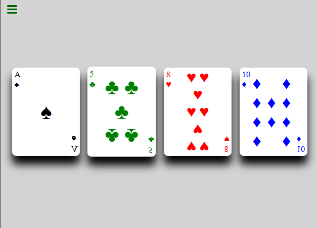
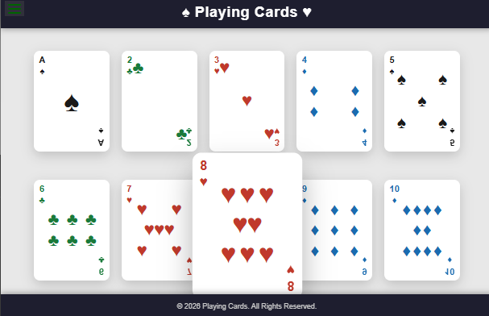
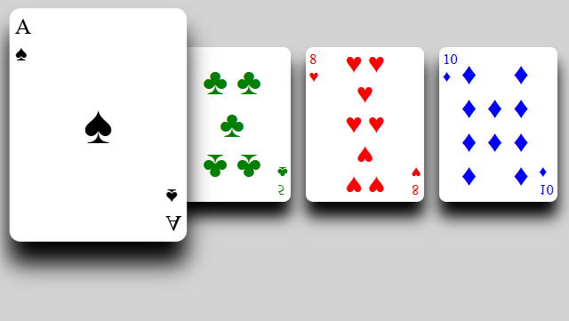

# playing-cards-design

---

## 🛠️ Customisation

You can tweak the following CSS variables directly in `styles.css`:

- **Card size** – adjust the `.card` `width` and `height`.
- **Hover scale** – change `transform: scale(1.45)` inside `.card:hover`.
- **Colours** – update the suit colour rules (`.spade`, `.club`, `.heart`, `.diamond`).
- **Gap** – modify the `gap` property in `#playing-cards` to change spacing between cards.

---

## 📸 Screenshots

| Original (single‑file) | Updated (separated) | Hover interaction |
|------------------------|---------------------|-------------------|
|  |  |  |

---

## 📝 Licence

This project is for demonstration purposes.  
Feel free to use and modify it as you like.

---

*Made with ♠, ♥, ♦, ♣ – and a bit of CSS.*
